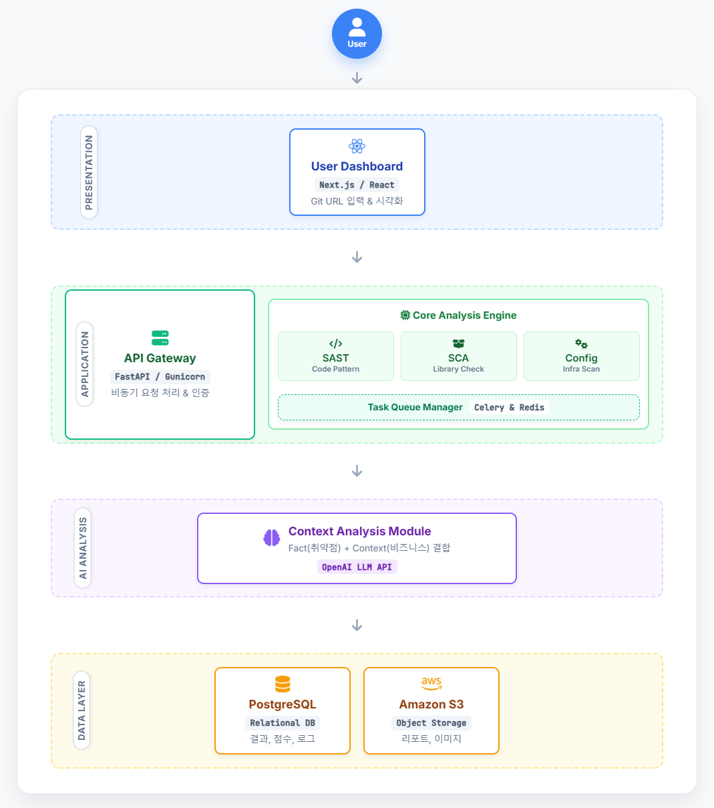

# 🛡️ AI 기반 PQC(양자내성암호) 전환 우선순위 진단 플랫폼

> **AI-based PQC Transition Priority Diagnosis Platform**
>
> 사용자의 GitHub 레포지토리를 분석하여 PQC 취약점을 탐지하고, AI 기반으로 비즈니스 문맥을 고려한 전환 우선순위를 제안하는 솔루션입니다.

<br>

## 🏗️ 소프트웨어 구조도



1.  **Presentation Layer (Next.js)**
    - 사용자가 GitHub URL을 입력하고 분석 결과를 확인하는 대시보드입니다
    - 서버로부터 받은 JSON 데이터를 기반으로 **PQC 준비도 히트맵**과 **전환 로드맵**을 시각적으로 렌더링합니다

2.  **Application Layer (FastAPI & Scanners)**
    - **API Gateway**: 요청을 받아 인증을 처리하고, 대규모 작업을 처리하기 위해 **Celery & Redis** 비동기 큐로 작업을 넘깁니다.
    - **3-Way Scanners**:
        - `SAST`: 소스코드 내부의 암호 함수 호출 패턴을 분석합니다.
        - `SCA`: 프로젝트의 종속성(라이브러리)을 분석하여 PQC 미지원 버전을 탐지합니다.
        - `Config`: 설정 파일 및 인증서의 취약점을 진단합니다.

3.  **AI Analysis Layer (OpenAI)**
    - 스캐너가 수집한 '기술적 취약점(Fact)'과 사용자의 '비즈니스 문맥(Context)'을 결합합니다.
    - LLM을 활용해 단순 탐지를 넘어 **리팩토링 비용**과 **전환 우선순위**를 산출합니다.

4.  **Data Layer (PostgreSQL & S3)**
    - 분석 결과와 사용자 로그 등 구조화된 데이터는 **PostgreSQL**에 저장합니다.
    - 생성된 PDF 리포트나 시각화용 이미지 파일은 **Amazon S3**에 저장하여 성능을 최적화합니다.

<br>
  
## 🌍 System Environment

| 환경 (Environment) | 목적 (Purpose) | 구성 요소 (Components) |
| :--- | :--- | :--- |
| **💻 개발 (Dev)** | 기능 구현 및 단위 테스트 | • **OS:** Local PC (Win/Mac)<br>• **Infra:** Docker Desktop (Local DB/Redis)<br>• **Tool:** VS Code |
| **🚀 운용 (Prod)** | 실제 사용자 진단 서비스 | • **Cloud:** AWS EC2<br>• **CI/CD:** GitHub Actions<br>• **Monitoring:** Sentry, CloudWatch |
| **🎤 데모 (Demo)** | 발표 및 기능 시연 | • **Data:** Pre-set Sample Project (취약점 포함)<br>• **Feature:** PQC Readiness Dashboard 시연 최적화 |

<br>

## 📅 Project Roadmap & Backlog
### 📌 EPIC별 Product Backlog

| EPIC | 주요 기능 (Stories) | 담당자 | Story Point |
| :--- | :--- | :---: | :---: |
| **Core Scanning** | • SAST(암호패턴), SCA(라이브러리), Config(설정) 스캐너 구현 | 최진혁, 경건웅 | **13** |
| **AI & Risk** | • OpenAI 프롬프트 엔지니어링<br>• 위험도/비용 산출 알고리즘 | 허준영 | **8** |
| **Backend** | • FastAPI 설계 및 비동기 큐(Celery) 연동<br>• DB 스키마 설계 | 허준영, 최진혁 | **8** |
| **Dashboard** | • 히트맵 시각화 및 리포트 PDF 다운로드 구현 | 경건웅 | **5** |

<br>
### 🚀 수행 로드맵 (Project Roadmap)

```mermaid
graph TD
    %% 노드 정의
    P1[Phase 1: 기획 및 설계<br/>📅 10월 ~ 12월]
    P2[Phase 2: 핵심 엔진 구현<br/>📅 1월 <br/>]
    P3[Phase 3: 플랫폼 통합<br/>📅 1월 말 ~ 2월 초]
    P4[Phase 4: 안정화 및 문서화<br/>📅 2월 ~ 3월]

    %% 연결
    P1 --> P2 --> P3 --> P4

    %% 스타일링 (완료: 초록, 진행중: 빨강, 예정: 회색)
    classDef done fill:#dcfce7,stroke:#166534,stroke-width:2px,color:#166534;
    classDef active fill:#fee2e2,stroke:#ef4444,stroke-width:4px,color:#b91c1c;
    classDef future fill:#f3f4f6,stroke:#9ca3af,stroke-width:2px,color:#4b5563;

    %% 클래스 적용
    class P1 done;
    class P2 active;
    class P3,P4 future;
